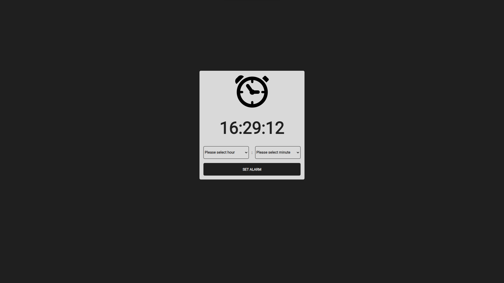

# Alarm clock

👋 Hi, I'm @liudasbo

📧 Contacts :

* [LinkedIn](www.linkedin.com/in/liudasbo)
* [Twitter](https://twitter.com/liudasbo)
* [Discord](https://discordapp.com/users/Liudas#1356)

## Application Description

This is a simple "Alarm clock" WEB app, the application allows the user to see the current time, set alarm to a selected time and when the selected time hits the current time play an alarm sound.

## Objective

The main goal of this simple project is to continue building fundamental knowledge about HTML, CSS and JavaScript languages.

## Screenshots

Desktop: 
 

## Viewing the application

https://liudasbo.github.io/alarm-clock/

## Project version

Currently, the project version is: 1.0.0

* 1.0.0 - First release.
